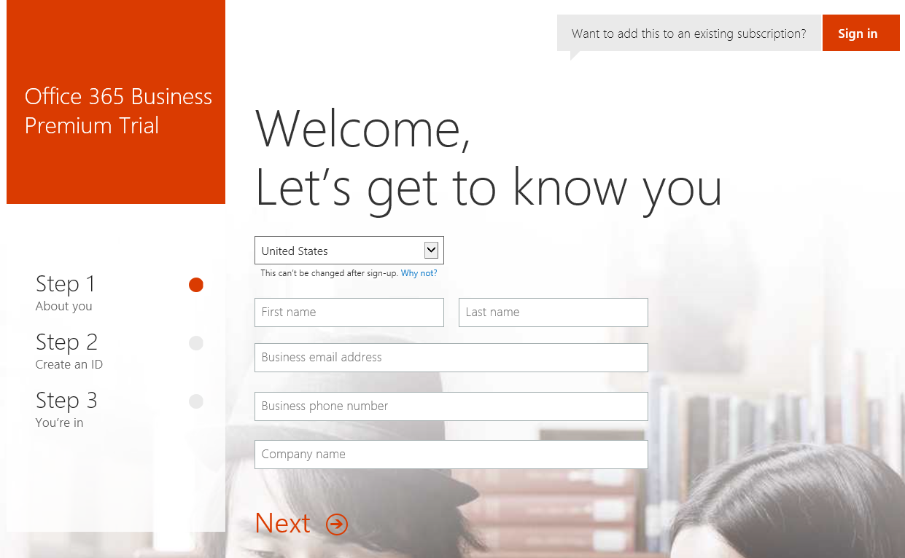
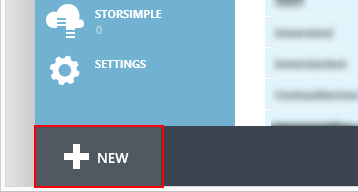
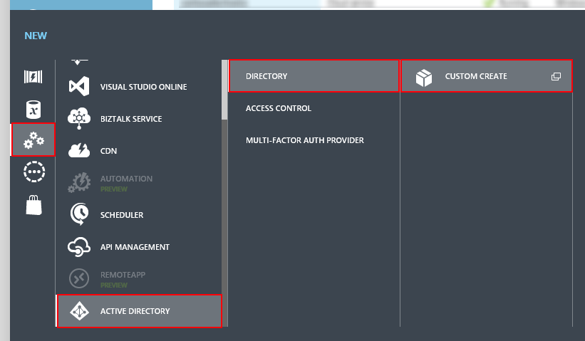
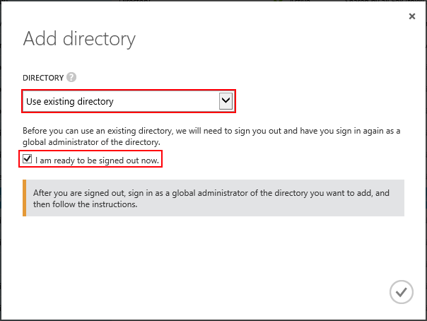
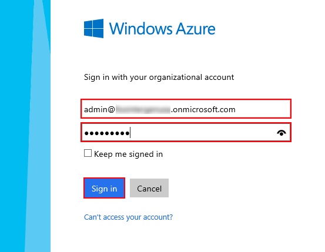
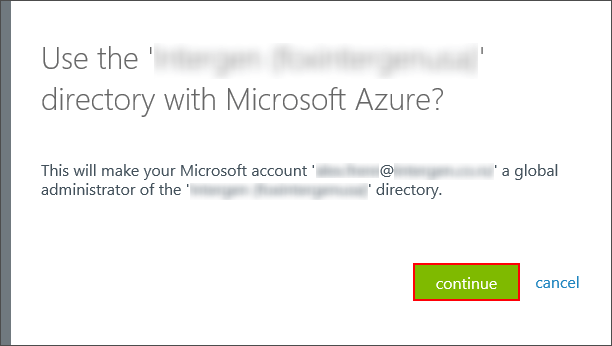
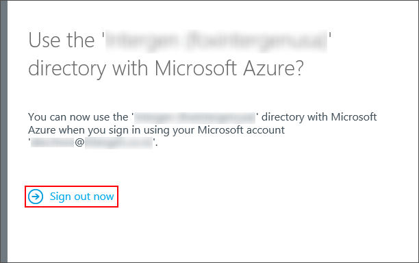

# Setting up your Development Environment in Office 365
In this lab, you will create a cloud development environment for Office 365. 

## Exercise 1: Obtain Office 365 and Azure subscriptions 
In this exercise you obtain trial subscriptions to Office 365 and Azure. If you already have these subscriptions, you can skip this exercise.

###Task 1 - Sign up for an Office 365 developer subscription
Follow these steps to sign up for an Office 365 developer subscription.

1. Navigate to the [Office Dev Center](http://msdn.microsoft.com/en-us/library/office/fp179924(v=office.15).aspx)
2. Under the heading **Sign up for an Office 365 Developer Site** click **Try It Free**. 
  
3. Fill out the form with your personal information accordingly (phone number, email address , company name etc.) and click the ** next ** button below the form to move to next step. 
    

4.  Choose your username and password and click the **Next** button below then move to next step. We reccomend using **admin** as your username. 
    

5.  Enter your mobile phone number, click **Text me**
    
6.  You should be able to recive a register code in a few minutes. Put the code to text box click **Create my account**
    

7.  Remember the information and click the ** You're ready to go ** button below to start the provisioning process. 
  a.  Notice that this is a trial tenant which does not cause you any additional costs, and you don’t have to continue using it afterwards.
    
 
 
8.  Wait for the initial provisioning actions to be completed. This could take anywhere from a few minutes to a half an hour.
    
9.  When completed, you will have a developer site in the [subscription].sharepoint.com domain located at the root of your subscription (e.g. https://mysubscription.sharepoint.com)

###Task 2 - Activate an Azure Trial Subscription
In this step we'll either activate a new Azure Trial Subscription with our newly created O365 tenant accounts (admin@[tenant].onmicrosoft.com) or link our tenants with an existing Azure Account
####Option 1 - Create a new free trial (easy way)
3. Sign up for an Azure trial subscription
  1. Navigate to the [Azure Portal](https://manage.windowsazure.com)
  2. When prompted, log in using the credentials you created for your O365 subscription.(admin@[tenant].onmicrosoft.com)
  3. After logging in, you should see a screen notifying you that you do not have a subscription 
     
  4. Click **Sign Up for Windows Azure**
  	
  5. Fill out the form to obtain your free trial. We'll be using it throughout the day. 
  NOTE: YES, you need to enter your credit card info, this is how we prove you're an adult and not gaming the system. NO, we won't bill you unless you explicitly let us. You will get repeated emails asking if you want to start paying, and unless you respond to an email and agree to start paying, you won't get charged. 

####Option 2 - Tie your newly made O365 subscription to your current azure subscription. (challenging/complicated)

00. Open an incognito/inPrivate/Private browser window. You can typically do this by right clicking on your favorite browser in the task bar, and selecting the private version it supports. 
01. Sign into the [Azure Portal](https://manage.windowsazure.com/) with your current azure account.

02. Click **+ New**

    

03. Select **App Services > Active Directory > Directory > Custom Create**

    

04. Select **Use existing directory**, and then **I am ready to be signed out now**

    

05. You will be signed out of the portal and redirected to a sign-in page. Sign in using the credentials for a global
    administrator in your O365 tenant.

    

06. When authenticated click **continue**. This will add your Azure account as a global administrator of the O365
    directory.

    

07. Click **Sign out now** and when prompted sign back into your Azure account.

    

You have successfully associated your Azure account with your O365 tenant as a global administrator.
This gives you the ability to manage the O365 directory using the Azure portal.

###Task 3 (Optional) - Enable Yammer
2. Enable Yammer for Social Expereince
  1. Log into [subscription].sharepoint.com
  2. Click **Admin/SharePoint**.
	  
  3. Search for Yammer, and click **Office 365 >> Activate Yammer Enterprise**
	  
  4. Change the Enterprise Social Collaboration setting to **Yammer**.
